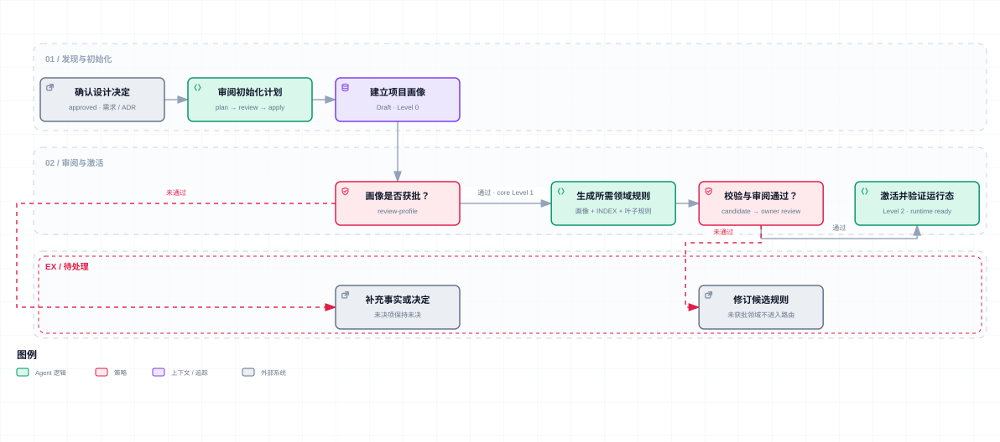
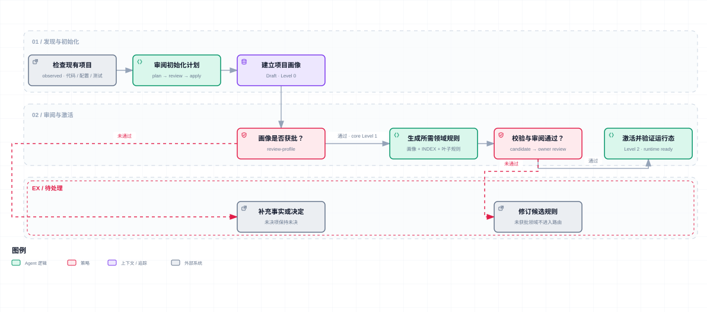
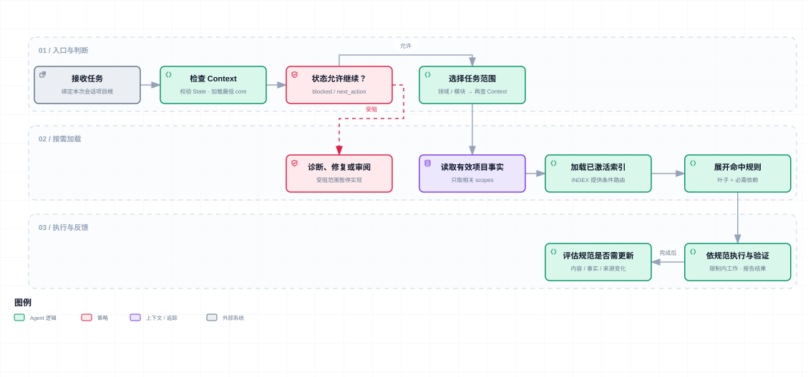

<div align="center">

# Rulers Constructor

**让项目约定跟得上 AI 开发。**

为你的项目搭建一套可维护、按需加载、带验证流程的 AI 规范约束框架。

[English](README.md) · **简体中文** · [开始使用](#开始使用) · [参与贡献](CONTRIBUTING-zh.md)

</div>


## 把反复提醒，变成项目的一部分

“这个接口要走现有鉴权。”“数据库变更要带迁移脚本。”“前端不要再封装一套请求层。”

这些约定，你可能已经向 AI 解释过很多次。换一个会话、一个模型，或开始跨仓库开发，又得重新交代。把它们全塞进一个文件，很快又会遇到另一组问题：该读的找不到，过期的还在生效，改一条规则不知道会影响哪里。

Rulers Constructor 通过 **`ai-rulers-init` Skill**，帮助你把项目事实、团队决定和验证要求整理成一套有结构的协作规范。它负责建立入口、组织规则、记录审阅状态，并提供后续修改和校验的流程。

项目的答案由你和团队决定。这套框架负责让那些决定有地方存放、有条件加载、有办法更新。

## 它在 AI 开发中承担什么

这里的 **harness**，指 AI 开发时围绕模型工作的上下文、约束和反馈机制。Rulers Constructor 负责其中的**规范约束层**：模型该依据哪些项目事实、当前任务该加载哪些规则、变更怎样进入有效规范，以及完成后如何验证。

| 你需要解决的问题 | Skill 提供的机制 |
| --- | --- |
| 每次会话重新解释项目 | 将事实、证据和已批准决定整理成项目画像，保存在仓库中 |
| 长规范挤占上下文 | 从入口到领域索引，再到命中规则，按任务逐步加载 |
| 模板与项目实际不符 | 依据现有代码或已批准设计生成候选，由项目维护者审阅 |
| 规则越积越多 | 支持新增、修改、删除、移动、合并与拆分，维护索引和依赖 |
| 改完规则不确定是否能用 | 检查路径、引用、审阅记录、文件漂移与激活状态 |
| 多仓库约定互相干扰 | 按直接 Git submodule 隔离模块规则，主工程审阅后采纳快照 |

AI 负责发现证据、起草内容和解释取舍；脚本负责差异、哈希、状态、事务与加载清单；你负责确认约束是否适合项目。规则的质量仍取决于这些判断，执行权限仍由开发工具、测试和 CI 等环境控制。

## 生成之后，才开始发挥作用

名字保留了 `init`，工作流覆盖的却是规范的整个维护过程。

```text
项目事实 / 已批准设计
        ↓
候选规范 → 审阅 → 应用与激活 → 按任务加载 → 开发与验证
   ↑                                            │
   └────────── 项目变化、失败案例、团队反馈 ────────┘
```

例如，团队决定新增缓存层。你可以让 Skill 根据批准的设计补充缓存规则，放进后端领域并更新索引；原有的不适用规则可以同时删掉。变化领域重新审阅后激活，后续模板升级保留这些定制和删除决定。

换用模型时，也可以继续调整规则的粒度和表达。优先补充具体失败案例、明确加载条件，删掉重复或无效要求；规则的数量本身不代表约束效果。

## 从新项目到多仓库工作区

**新项目：先把决定说清楚。** 还没有代码时，可以从已批准的架构、接口约定和交付要求建立规范。计划中的能力会与已实现事实分开记录，未决定的内容保持未决。

以下两张图展示单项目内部的审阅与激活阶段。默认初始化会先自动发现主子工程、汇总候选，再由一次集中审阅覆盖相关审批点。



[交互版 HTML](assets/diagrams/rulers-flows/greenfield-init.zh.html) · 补齐未决输入或修订候选后，重新进入对应审阅步骤。

**已有项目：从实际做法出发。** 从代码、配置、测试和文档提取证据，再审阅其中哪些应成为约束。已有实现与团队目标冲突时，保留问题供人判断。



[交互版 HTML](assets/diagrams/rulers-flows/brownfield-init.zh.html) · 图示为已有代码工程首次建立规范。已有安装可再次调用初始化检查增量；明确的升级或修复仍使用对应维护流程。

**Git submodule 工作区：保留独立开发能力。** 一个直接子仓库对应一个模块，内部可以包含多个技术领域。子仓库维护可移植规则源，主工程保存采纳快照和组合调整。初始化会自动检查本地来源变化，独立同步也可由用户手动触发；未提交规则也能在审阅后采纳，身份绑定实际内容和相关代码证据。

独立打开子仓库时使用它自己的规则。组合开发时显式绑定主工程根，再选择模块和领域。详见[模块规则工作流](skills/ai-rulers-init/references/module-workflows.md)。

## 开始使用

需要 Python 3.11+，运行环境为 macOS / Linux；Windows 使用 WSL。脚本运行时无需第三方 Python 依赖。模块工作流还需要 Git。

### 1. 获取 Skill

```bash
git clone https://github.com/AndersJet/ai-rulers-constructor.git
```

将 [`skills/ai-rulers-init/`](skills/ai-rulers-init/) 安装到客户端支持的 Skill 目录。支持 `.skill` 导入的客户端，也可以使用[打包文件](skills/ai-rulers-init.skill)。安装方式以所用客户端为准。

也可以让能够读取本地文件、执行 Python 的助手从克隆目录中的 [`SKILL.md`](skills/ai-rulers-init/SKILL.md) 开始。接入时应确认助手能读取项目入口并运行校验命令。

### 2. 在目标项目中发起

> 使用 ai-rulers-init 初始化当前项目。

Skill 会先运行确定性发现：识别会话根、已有规则和直接 Git submodule，默认纳入全部模块。缺少的画像与规则由 Agent 根据证据准备，主子工程的实际差异集中审阅后应用。未初始化模块标记待接入；归属不清的规则保持原样并汇总处理。再次调用只生成增量计划，无变化直接结束。

默认初始化保留已有安装策略；新安装使用 `project-native`，保留项目既有提交发布约定。需要中文提交策略时可显式选择 `strict-cn`。底层 `plan` 命令继续保留旧默认值；默认 Skill 工作流通过 `init-plan` / `init-apply` 集中处理候选、审阅与激活。

需要直接检查初始化计划时，从本仓库根目录运行：

```bash
python3 skills/ai-rulers-init/scripts/rulers_init.py init-plan \
  --project-root /absolute/path/to/project
```

该命令自动发现并生成准备清单或审阅计划。后续步骤见[默认初始化工作流](skills/ai-rulers-init/references/initialization.md)。无需先手动列出 server、ui 等模块名称。

初始化会返回三种结果：

| 状态 | 接下来做什么 |
| --- | --- |
| `preparation` | Agent 继续补齐候选，需要你决定的问题集中提出 |
| `review` | 审阅已列出的实际变更，并确认哪些模块仍待处理 |
| `noop` | 没有可应用的变化，直接结束 |

默认纳入全部直接子模块；排除决定会被保存，后续也可重新纳入。完整参数和中断恢复方式见[初始化工作流](skills/ai-rulers-init/references/initialization.md)。

### 3. 在开发中维护

把实际遇到的问题交给 Skill，而不必先记住每个命令：

- “这条约束只适用于支付模块，请放到正确位置，并移除公共规则中的重复内容。”
- “项目增加了移动端，先检查哪些事实和规范需要补充。”
- “这套规范已经太长，请按近期失败案例检查哪些值得保留。”
- “检查 server 模块规则的变化，保留主工程调整，列出需要审阅的差异。”

## 项目里会留下什么

默认安装到 `documents/rulers/`，目录可以自定义。领域目录按项目需要建立。

| 内容 | 用途 |
| --- | --- |
| 根 `AGENTS.md` 入口 | 指向本项目的规则加载流程 |
| `.gitignore` | 审阅后补充 `/.rulers-work/`，随正式规则提交给团队 |
| `.rulers-work/` | 本机候选、计划与恢复记录；日常加载不依赖它 |
| `PROJECT_PROFILE.md` | 事实、证据与批准决定；按 `collaborative` 所有权维护 |
| `RULERS_STATE.json` | 脚本维护的生命周期、审阅、激活和文件所有权记录 |
| `core/` | 最低常驻约束，以及按条件加载的治理、维护等规则 |
| 领域 `INDEX.md` 与叶子规则 | 导航与具体约束，正文放在所属专题中 |
| `modules/` | 可选的模块采纳快照与主工程调整 |
| `scripts/` | 校验状态并输出当前任务的加载清单或正文 |

日常加载路径为：



[交互版 HTML](assets/diagrams/rulers-flows/task-loading.zh.html) · 选择范围后仍要检查其状态；未激活或失效的规则不能因任务命中就生效。任务反馈进入维护流程，修订经审阅后再供后续任务加载。

图中的交互版需下载 HTML 后用浏览器打开，可缩放、切换明暗主题和导出。

State 由脚本读取；日常上下文消费紧凑的 Context。审阅和激活记录决定规则是否可用：Level 0 准备事实与候选，Level 1 支持核心约束下的低风险工作，Level 2 用于已激活领域，Level 3 readiness 表示交付准备度，具体生产操作仍需授权。

## 验证与维护入口

在**已安装的目标项目根目录**检查候选与运行态：

```bash
python3 documents/rulers/scripts/validate_rulers.py --mode candidate --project-root .
python3 documents/rulers/scripts/validate_rulers.py --mode runtime --project-root .
python3 documents/rulers/scripts/validate_rulers.py --mode context --project-root . --domain backend
```

使用自定义目录时，调整脚本路径并追加 `--rulers-dir`。跨目录执行时，`--project-root` 始终使用本次会话绑定的绝对根路径。

| 接下来要做的事 | 工作流 |
| --- | --- |
| 修改规则正文和结构 | [maintenance](skills/ai-rulers-init/references/maintenance.md)：`rules-plan` / `rules-apply` |
| 更新事实或设计决定 | [incremental](skills/ai-rulers-init/references/incremental.md)：reconcile 计划 |
| 登记已有领域候选并激活 | [activation](skills/ai-rulers-init/references/activation.md)：`register-domain-candidate` |
| 升级模板或处理漂移 | [lifecycle](skills/ai-rulers-init/references/lifecycle.md)：upgrade / repair |
| 迁移旧版无 State 安装 | [migration-v1](skills/ai-rulers-init/references/migration-v1.md)：`migrate-v1` |

校验能发现失效引用、未审阅状态、文件漂移和过期计划；规则是否正确、是否帮助模型完成任务，还需要真实任务检验。仓库包含公开 CLI 与分发一致性测试，真实模型评测场景位于 [evals](skills/ai-rulers-init/evals/evals.json)，目前尚未执行。

## 一起把框架做实

欢迎带着一次具体失败来贡献：模型在哪个任务读错了规则？哪条约束已经过期？删掉哪些内容后，任务反而更清楚？这类证据有助于决定框架该改在哪里。

[贡献指南](CONTRIBUTING-zh.md) · [提交问题](https://github.com/AndersJet/ai-rulers-constructor/issues) · [变更记录](CHANGELOG.md)
