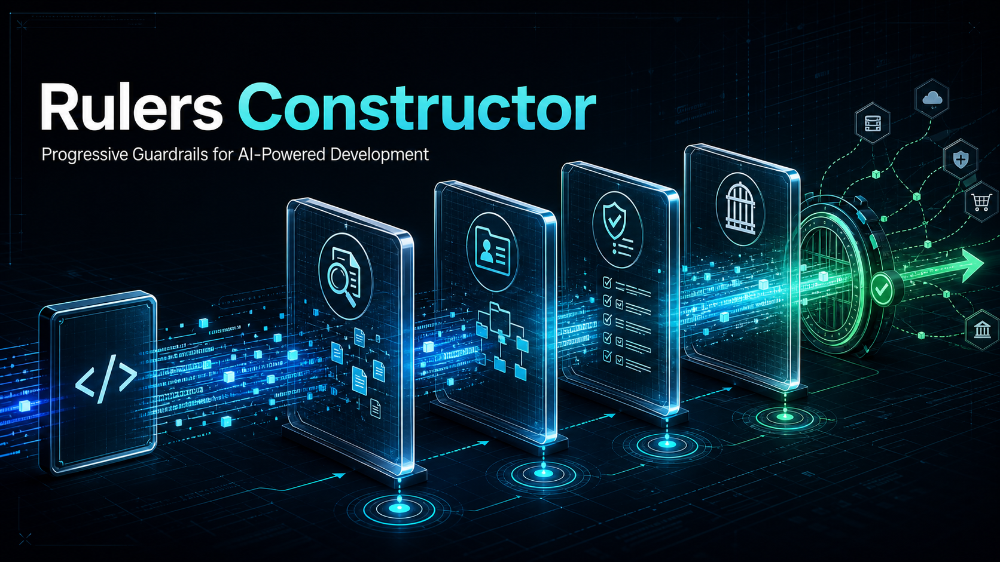
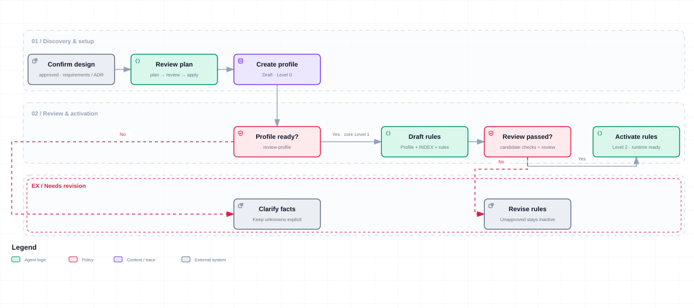
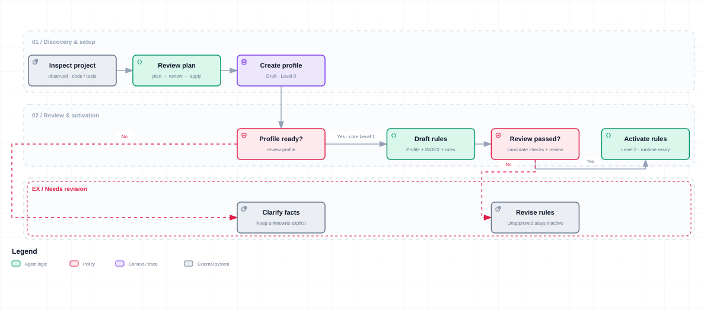
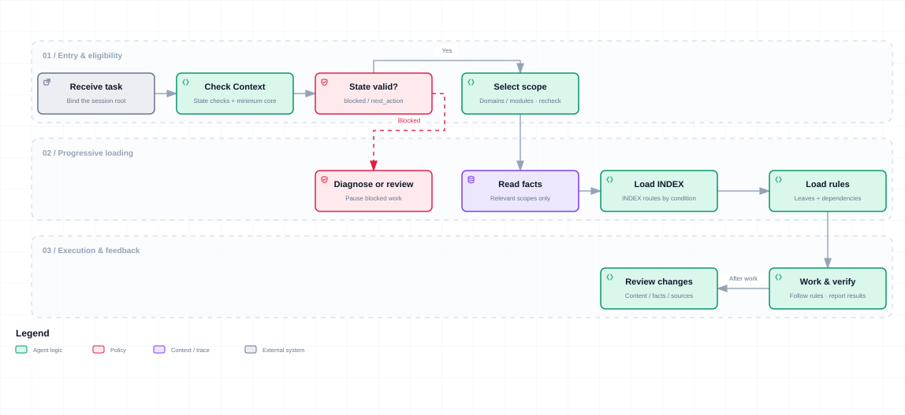

<div align="center">

# Rulers Constructor

**Keep project conventions in step with AI development.**

A Skill for building and maintaining the rules layer of your AI coding harness.

**English** · [简体中文](README-zh.md) · [Get started](#get-started) · [Contribute](CONTRIBUTING.md)

</div>



## Give recurring instructions a home

“Use the existing authorization layer.” “Include a migration with schema changes.” “Keep frontend requests in the shared client.”

You may have explained these conventions many times. A new session, a different model, or work across repositories brings another round of explanations. Putting everything in one large file creates its own problems: relevant rules become hard to find, old instructions linger, and a small edit has unclear consequences.

Rulers Constructor uses the **`ai-rulers-init` Skill** to organize project facts, team decisions, and verification requirements into a maintainable set of agent rules. It establishes an entry point, routes tasks to relevant rules, records reviews, and provides workflows for later changes.

Your team decides what the project needs. The framework gives those decisions a place to live, a reason to load, and a way to change.

## Its role in your harness

A coding **harness** supplies the context, constraints, and feedback around a model. Rulers Constructor handles the **rules layer**: which project facts an agent should use, which instructions apply to a task, how changes become accepted rules, and how work should be checked.

| What gets in the way | What the Skill provides |
| --- | --- |
| Repeating project context in every session | A repository-owned profile of facts, evidence, and approved decisions |
| Large rule files consuming context | Progressive loading through an entry point, domain indexes, and selected rules |
| Generic templates that do not fit | Candidates grounded in existing code or approved designs, with project-owner review |
| Rules that only ever grow | Workflows to add, edit, remove, move, merge, and split rules, including their routes and dependencies |
| Uncertainty after changing a rule | Checks for paths, references, review records, file drift, and activation state |
| Conflicting conventions across repositories | Rules scoped to direct Git submodules, with reviewed snapshots in the parent workspace |

The agent finds evidence, drafts content, and explains choices. Scripts handle diffs, hashes, state, transactions, and load lists. You decide whether the constraints fit. Their quality still depends on that judgment; tools, tests, CI, and host permissions retain their own enforcement roles.

## Useful beyond initialization

The name retains `init`; the workflow covers ongoing rule maintenance.

```text
Project facts / approved designs
             ↓
Candidates → review → apply and activate → task-scoped loading → development and checks
    ↑                                                                    │
    └──────────────── project changes, failures, team feedback ────────────┘
```

Suppose the team approves a caching layer. Ask the Skill to add the relevant rules to the backend domain and update its index. Remove rules that no longer apply in the same candidate. Review and reactivate the changed domain; later template upgrades preserve the project's custom content and deletion decisions.

When switching models, you can also adjust the detail and wording of rules. Start with a concrete failure, sharpen the loading conditions, and remove repetition. Rule count alone tells you little about how well the framework works.

## From a new project to a multi-repository workspace

**New projects start with decisions.** Approved architecture, interface contracts, and delivery requirements can supply the first rules before code exists. Planned capabilities stay distinct from observed implementation; open questions remain open.

The two diagrams below show review and activation inside a single project. Default initialization first discovers the parent and child projects and collects their candidates; one consolidated review can cover the relevant approval points.



[Interactive HTML](assets/diagrams/rulers-flows/greenfield-init.en.html) · Return to the relevant review step after clarifying inputs or revising candidates.

**Existing projects start with evidence.** Inspect code, configuration, tests, and documentation, then review which practices should become constraints. Where current behavior conflicts with the team's intent, surface the disagreement for a decision.



[Interactive HTML](assets/diagrams/rulers-flows/brownfield-init.en.html) · This shows first-time setup for an existing codebase. Repeat initialization to check an existing installation for incremental changes; explicit upgrades and repairs use their maintenance workflows.

**Git submodule workspaces keep independent ownership.** Each direct submodule is one module, even if it contains several technical domains. The child repository owns portable rule sources; the parent owns accepted snapshots and workspace adjustments. Initialization checks local source changes; explicit module sync is also available. Uncommitted rules can be accepted after review, with identity tied to actual content and relevant code evidence.

An independently opened child uses its own rules. Combined development binds the parent project root explicitly, then selects modules and domains. See the [module workflow](skills/ai-rulers-init/references/module-workflows.md).

## Get started

Use Python 3.11+ on macOS or Linux, or WSL on Windows. The runtime scripts need no third-party Python dependencies. Module workflows also require Git.

### 1. Get the Skill

```bash
git clone https://github.com/AndersJet/ai-rulers-constructor.git
```

Install [`skills/ai-rulers-init/`](skills/ai-rulers-init/) in your client's supported Skill directory. Clients that support `.skill` imports can use the [packaged Skill](skills/ai-rulers-init.skill). Follow the installation method for your client.

An assistant with local file access and Python execution can also start by reading [`SKILL.md`](skills/ai-rulers-init/SKILL.md) in the cloned repository. Check that it can read the target project's entry point and run its validation commands.

### 2. Start in the target project

> Use ai-rulers-init to initialize this project.

The Skill starts with deterministic discovery of the session root, existing rules, and direct Git submodules. All modules are included by default. The agent prepares missing facts and rule candidates from evidence, then presents the actual parent/child changes for one consolidated review. Uninitialized modules remain pending; ambiguous ownership preserves existing rules. Repeating initialization produces an incremental plan or exits with no changes.

Default initialization preserves an existing installation policy and uses `project-native` for new installations. Choose `strict-cn` explicitly for Chinese commit conventions. The low-level `plan` command retains its earlier default; the Skill uses `init-plan` / `init-apply` to consolidate preparation, review, and activation.

To inspect an initialization plan directly, run this from the constructor repository root:

```bash
python3 skills/ai-rulers-init/scripts/rulers_init.py init-plan \
  --project-root /absolute/path/to/project
```

This discovers the workspace and produces preparation items or a review plan. Continue with the [default initialization workflow](skills/ai-rulers-init/references/initialization.md). Module names do not need to be supplied in advance.

Initialization returns one of three outcomes:

| Status | What happens next |
| --- | --- |
| `preparation` | The agent completes candidates and groups decisions that need your input |
| `review` | Review the listed changes and confirm which modules remain pending |
| `noop` | There are no changes to apply; stop here |

All direct submodules are included by default. Exclusions are saved and can later be reversed. See the [initialization workflow](skills/ai-rulers-init/references/initialization.md) for parameters and interruption recovery.

### 3. Maintain it through real work

Bring a concrete request to the Skill without memorizing every command:

- “This constraint only applies to payments. Put it in the right scope and remove the duplicate from shared rules.”
- “We are adding a mobile client. Check which facts and rules need to change.”
- “Our rules have become too long. Review what is worth keeping against recent failures.”
- “Check the server module for rule changes. Preserve our workspace adjustments and show the reviewable diff.”

## What lives in the project

The default installation directory is `documents/rulers/`; it is configurable. Domains are established as the project needs them.

| Content | Purpose |
| --- | --- |
| Root `AGENTS.md` entry | Points to this project's loading workflow |
| `.gitignore` | Adds `/.rulers-work/` after review; commit the configuration for teammates |
| `.rulers-work/` | Local candidates, plans, and recovery records; not a runtime dependency |
| `PROJECT_PROFILE.md` | Facts, evidence, and approved decisions, with `collaborative` ownership |
| `RULERS_STATE.json` | Script-maintained lifecycle, review, activation, and file ownership records |
| `core/` | Minimum resident constraints plus conditionally loaded governance and maintenance rules |
| Domain indexes and leaf rules | Navigation and topic-specific instructions |
| `modules/` | Optional accepted module snapshots and workspace adjustments |
| `scripts/` | State validation and task-specific load lists or expanded rule content |

The normal loading path is:



[Interactive HTML](assets/diagrams/rulers-flows/task-loading.en.html) · Validate selected scopes too: matching a task does not activate an inactive or stale rule. Feedback enters maintenance; revisions require review before later tasks load them.

Download an interactive HTML file and open it in a browser for zoom, theme switching, and export.

Scripts read State; routine agent context consumes the compact Context projection. Review and activation records determine availability: Level 0 prepares facts and candidates, Level 1 supports low-risk work under core constraints, Level 2 covers activated domains, and Level 3 readiness records delivery preparation. Individual production operations still require authorization.

## Verification and maintenance

From the **installed target project's root**, inspect candidates and runtime state:

```bash
python3 documents/rulers/scripts/validate_rulers.py --mode candidate --project-root .
python3 documents/rulers/scripts/validate_rulers.py --mode runtime --project-root .
python3 documents/rulers/scripts/validate_rulers.py --mode context --project-root . --domain backend
```

For a custom directory, adjust the script path and pass `--rulers-dir`. When changing directories during a session, keep `--project-root` bound to the same absolute project root.

| Next task | Workflow |
| --- | --- |
| Change rule content or structure | [maintenance](skills/ai-rulers-init/references/maintenance.md): `rules-plan` / `rules-apply` |
| Update facts or approved decisions | [incremental](skills/ai-rulers-init/references/incremental.md): a reconcile plan |
| Register existing domain candidates and activate them | [activation](skills/ai-rulers-init/references/activation.md): `register-domain-candidate` |
| Upgrade templates or resolve drift | [lifecycle](skills/ai-rulers-init/references/lifecycle.md): upgrade / repair |
| Migrate an older installation without State | [migration-v1](skills/ai-rulers-init/references/migration-v1.md): `migrate-v1` |

Validation detects broken references, missing reviews, file drift, and stale plans. Whether a rule is correct and helps an agent complete a task still needs evidence from real work. The repository includes public CLI and distribution-parity tests. Live model scenarios are recorded in [evals](skills/ai-rulers-init/evals/evals.json) and have not yet been run.

## Help improve it with evidence

A useful contribution can start with one failed task. Which rule did the model miss? Which instruction was out of date? What became clearer after you removed it? These examples help decide where the framework should change.

[Contributing](CONTRIBUTING.md) · [Issues](https://github.com/AndersJet/ai-rulers-constructor/issues) · [Changelog](CHANGELOG.md)
